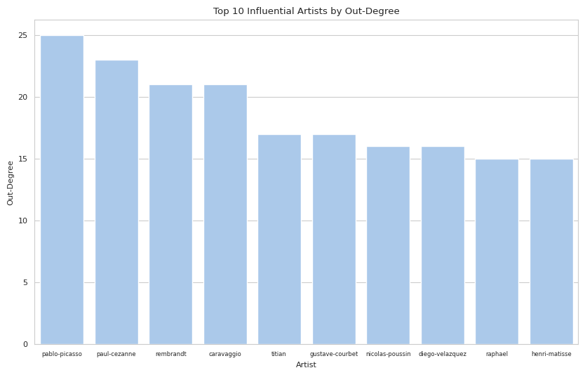
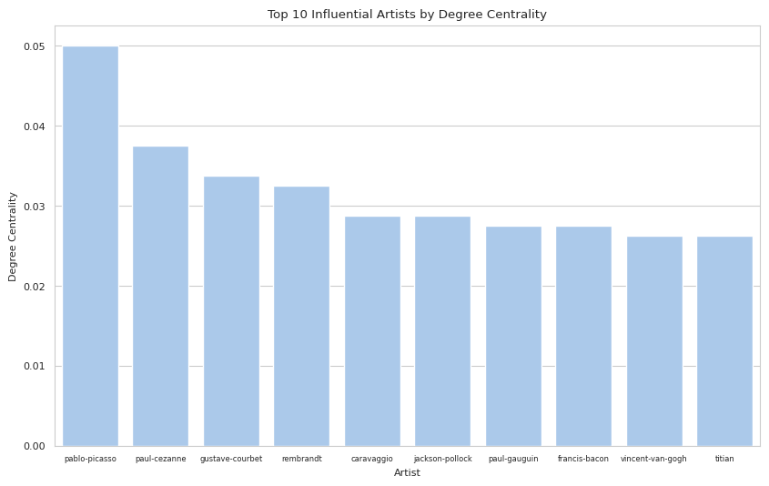
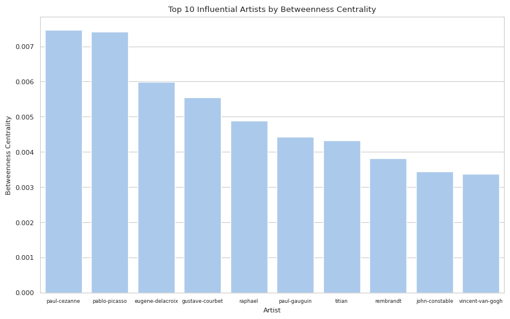
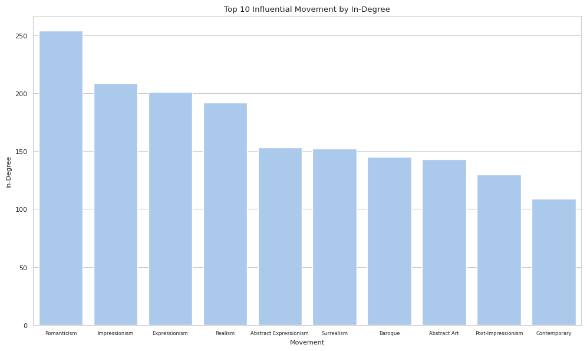
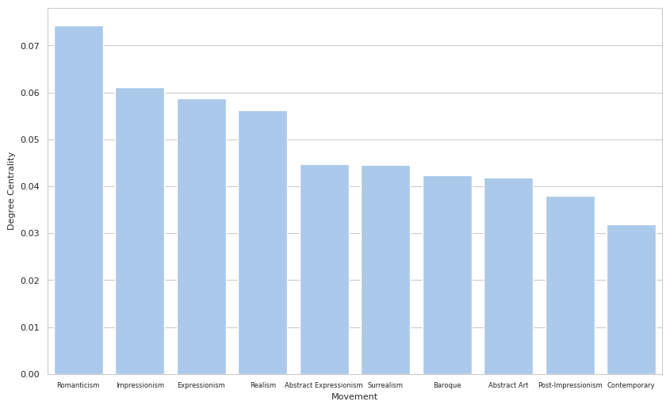
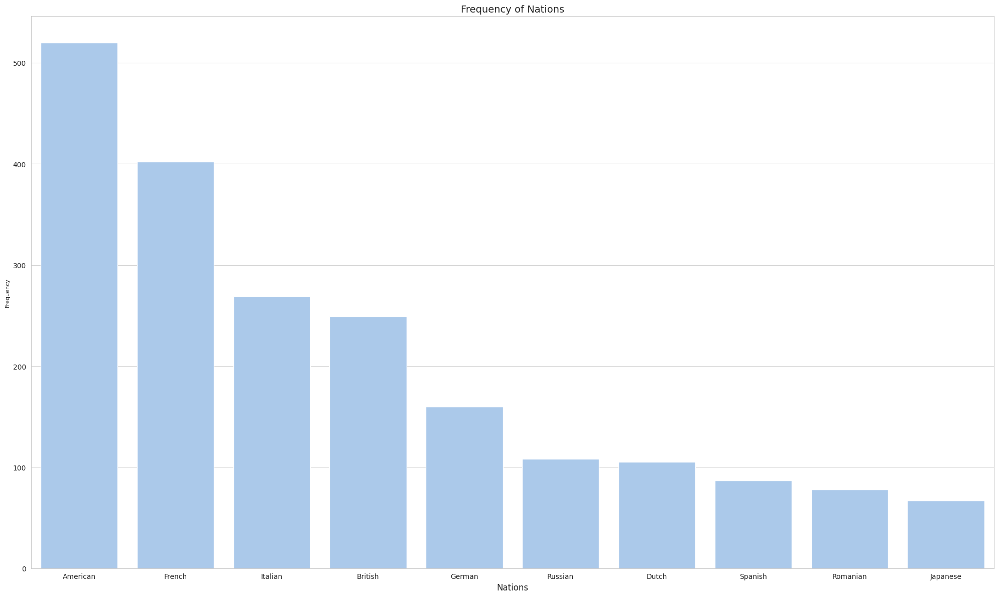
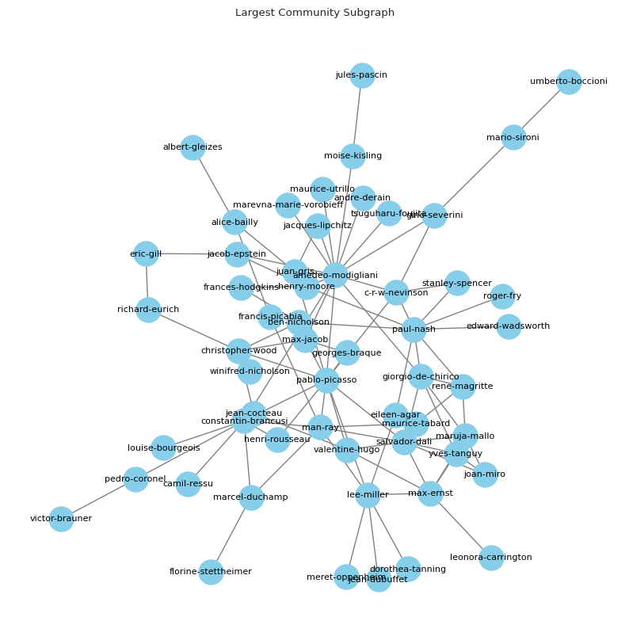

# Art Network Analysis

## Introduction

This project analyzes relationships between artists, movements, and institutions in the art world using network analysis techniques. By representing artists and their connections as a graph, we can identify influential figures, important movements, and communities within the art world.

## Dataset

The analysis uses four primary datasets:
- **artists.csv**: Contains information about individual artists
- **relationships.csv**: Contains connections between artists, including who influenced whom and friendships
- **institutions.csv**: Contains information about art institutions
- **schools.csv**: Contains information about art schools

## Setup and Dependencies

To run this analysis, you'll need the following Python libraries:
- NetworkX for graph analysis
- Pandas for data handling
- Matplotlib and Seaborn for visualization
- PyVis for interactive network visualization

Install dependencies with:
```bash
pip install networkx pandas matplotlib seaborn pyvis
```

## Results and Visualizations

### Artist Influence Network
The following visualization shows connections between artists based on influence relationships:





### Artistic Movements Communities
Community detection reveals clusters of artists belonging to similar movements. These visualizations demonstrate how artists naturally group based on stylistic similarities, shared philosophies, and temporal proximity:




### National Concentration
The following visualization shows the geographic distribution of influential artists, highlighting how artistic innovation concentrates in specific regions and time periods:



### Largest Community Subgraph
This visualization focuses on the most interconnected community in our network, revealing the dense relationships between artists within the dominant movement:



For interactive visualizations and more detailed analysis, see the [art_analysis.ipynb](art_analysis.ipynb) notebook.