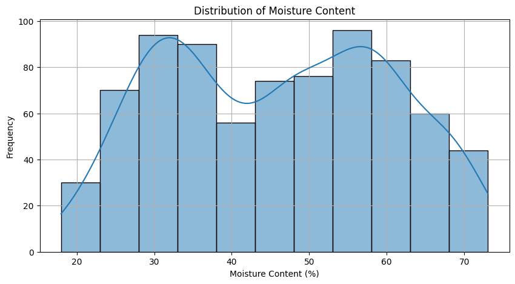

# Biomass Characterization through NIR Spectroscopy

## Overview
This project uses Near-Infrared (NIR) spectroscopy data to predict moisture content in biomass samples. It demonstrates various spectral preprocessing techniques and machine learning models to achieve accurate predictions from NIR spectra.

## Project Structure
- `biomass_characterization.ipynb` - Main Jupyter notebook containing all analysis code
- `images/` - Folder containing visualizations from the analysis
- Input data: NIR spectral data in Excel format with sample IDs and moisture content measurements

## Features
- Data exploration and visualization of NIR spectra
- Outlier detection using Mahalanobis distance
- Multiple spectral preprocessing techniques:
  - Savitzky-Golay filtering
  - Standard Normal Variate (SNV)
  - Multiplicative Scatter Correction (MSC)
  - Combined preprocessing approaches
- Machine learning models:
  - Partial Least Squares Regression (PLS)
  - Support Vector Regression (SVR)
  - Artificial Neural Networks (ANN)
- Model evaluation with group-aware cross-validation
- Comprehensive visualization of results

## Requirements
- Python 3.x
- Libraries: numpy, pandas, matplotlib, seaborn, scikit-learn, scipy

## Usage
1. Mount Google Drive (if using Google Colab)
2. Load NIR spectral data from Excel file
3. Run exploratory data analysis
4. Apply preprocessing methods
5. Train and evaluate machine learning models
6. Analyze results

## Data Exploration

The dataset consists of NIR spectra from biomass samples with corresponding moisture content measurements.

The spectra cover wavelengths from approximately 800 to 2500 nm, which is typical for NIR analysis.

## Outlier Detection

We use PCA for initial visualization and Mahalanobis distance for statistical outlier detection.

The Mahalanobis distance helps identify samples that have unusual spectral characteristics:

## Spectral Preprocessing

Various preprocessing techniques are applied to the raw spectra to enhance the predictive performance:

### Savitzky-Golay Smoothing

### Standard Normal Variate (SNV)

### Multiplicative Scatter Correction (MSC)

## Model Performance

The performance of different combinations of preprocessing methods and machine learning algorithms:

### R² Performance Comparison

### RMSE Performance Comparison

### Best Model Performance
The best performing model showing actual vs. predicted values:

## Results
The notebook compares different combinations of preprocessing methods and machine learning algorithms to find the optimal approach for predicting moisture content in biomass from NIR spectra.
