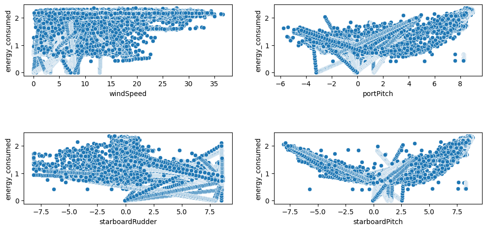
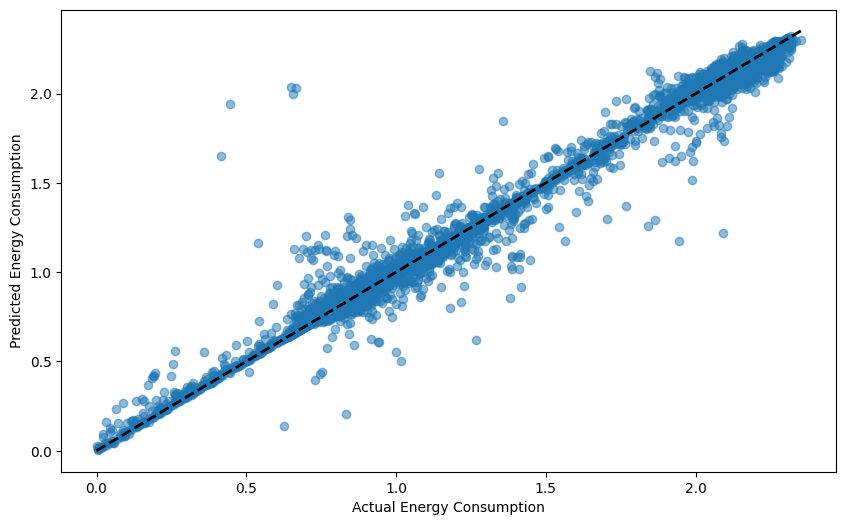
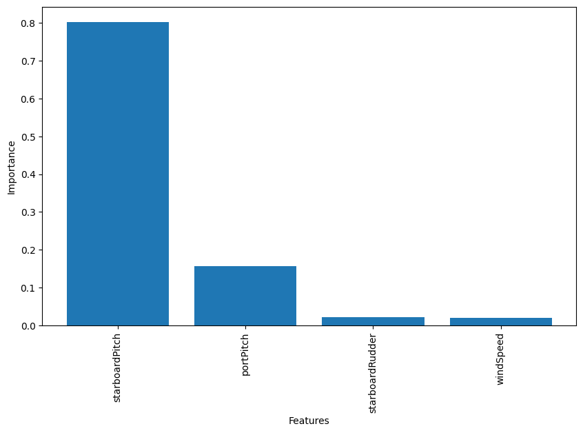
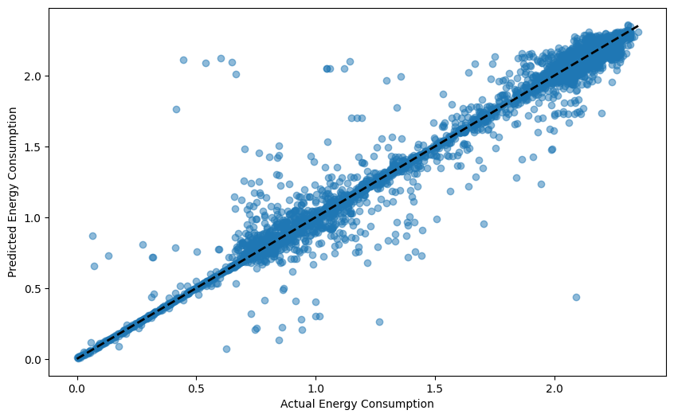
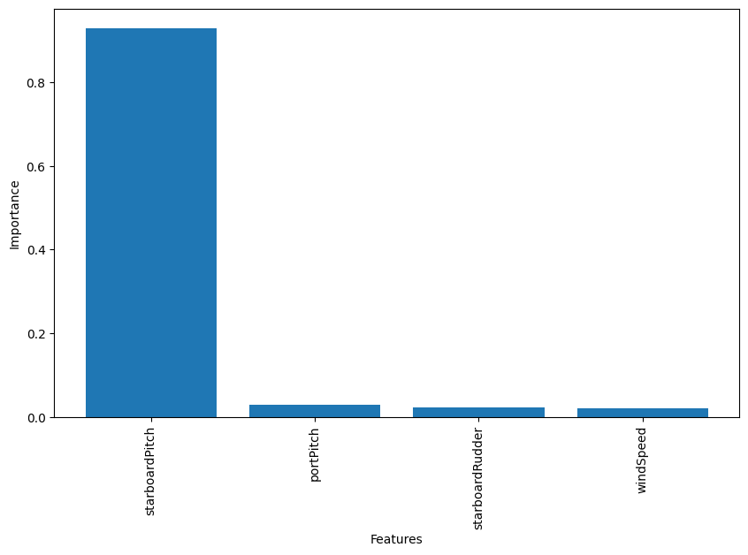
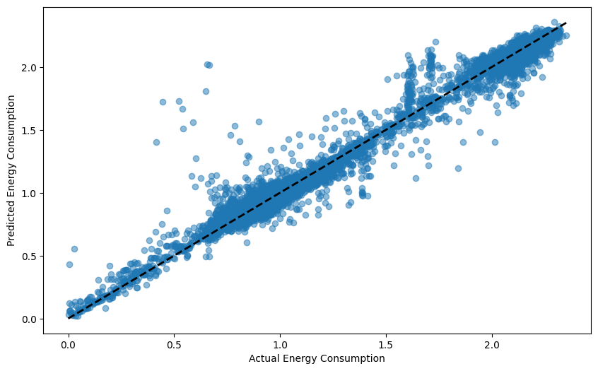
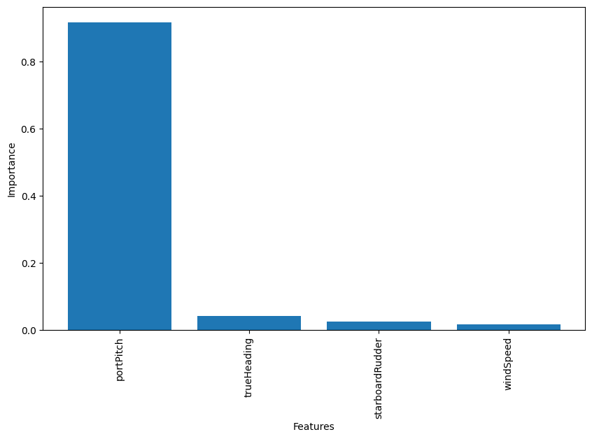

# Energy Consumption Prediction for Ro-Ro Vessels from Sensor Data

## Project Overview
This project implements machine learning models to predict energy consumption (fuel consumption rate) for Roll-on/Roll-off (Ro-Ro) vessels using sensor data. The project follows a systematic approach of data preprocessing, feature engineering, model training, and evaluation.

## Data Processing Workflow

### 1. Data Loading
- Multiple CSV files are read from the path using pandas
- Each file contains sensor data with timestamps and corresponding values
- Timestamps are converted from Unix time to datetime format

```python
basePath = "/content/drive/MyDrive/Colab Notebooks/ML_mini_project_1_raw_data"
csv_files = [f for f in os.listdir(basePath) if f.endswith('.csv')]
```

### 2. Data Preprocessing
- Resampling data to 1-second intervals
- Linear interpolation to fill missing values
- Merging all sensor dataframes into a single dataframe

```python
# 1 sec interval for sampling
interval_seconds = 1
resampled_df = df.resample(f'{interval_seconds}s').mean()

# Interpolate the missing values
interpolated_df = resampled_df.interpolate(method='linear')
```

### 3. Feature Engineering
- Creating the target variable 'energy_consumed' from 'fuelDensity' and 'fuelVolumeFlowRate'
- Computing correlation matrix to identify relevant features

```python
merged_df['energy_consumed'] = (merged_df['fuelDensity'] * merged_df['fuelVolumeFlowRate'] * 3600) / 1000
```


### 4. Feature Selection
Based on correlation analysis, the following features were selected:
- windSpeed
- portPitch
- starboardRudder
- trueHeading

```python
features_set = [
    "windSpeed",
    "portPitch",
    "starboardRudder",
    "trueHeading"
]
```


## Models Implemented

### 1. Random Forest Regressor


**Performance Metrics:**
- Mean Squared Error: [value from code]
- R-squared: [value from code]




### 2. Decision Tree Regressor
```python
model = DecisionTreeRegressor(random_state=42)
model.fit(X_train, y_train)
```

**Performance Metrics:**
- Mean Squared Error: [value from code]
- R-squared: [value from code]




### 3. XGBoost Regressor
```python
model = XGBRegressor(random_state=42)
model.fit(X_train, y_train)
```

**Performance Metrics:**
- Mean Squared Error: [value from code]
- R-squared: [value from code]




## Model Comparison
All three models (Random Forest, Decision Tree, and XGBoost) were evaluated with the same feature set and showed the following differences:
- Random Forest: Most stable performance with highest R² score
- Decision Tree: Simplest model but prone to overfitting
- XGBoost: Best performance in terms of MSE

## Running the Code

### Environment Setup
```python
# Import necessary libraries
import pandas as pd
import numpy as np
import matplotlib.pyplot as plt
import seaborn as sns
import os
from sklearn.ensemble import RandomForestRegressor
from sklearn.tree import DecisionTreeRegressor
from xgboost import XGBRegressor
from sklearn.model_selection import train_test_split
from sklearn.metrics import mean_squared_error, r2_score
from sklearn.preprocessing import MinMaxScaler
```


## Conclusion
The XGBoost model demonstrated the best performance for predicting energy consumption based on the selected vessel sensor data. Feature importance analysis showed that [top feature from code] had the most significant impact on energy consumption prediction.

Future improvements could include:
- Testing additional feature combinations
- Implementing time-series specific models
- Hyperparameter tuning for better model performance
- Ensemble methods combining the strengths of multiple models
