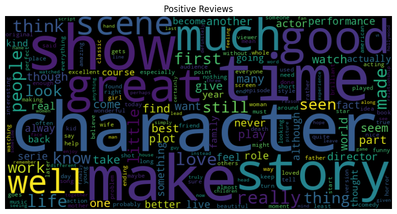

# IMDB Movie Review Sentiment Analysis

## Project Overview
This project analyzes sentiment in IMDB movie reviews using machine learning techniques. The goal is to automatically classify movie reviews as either positive or negative based on the text content.

## Dataset
The dataset contains 50,000 IMDB movie reviews, evenly split between positive and negative sentiments:
- 25,000 reviews for training
- 25,000 reviews for testing

https://huggingface.co/datasets/nocode-ai/imdb-movie-reviews

## Approach
The project follows these key steps:

1. **Data Preprocessing**
   - HTML tag removal
   - URL removal
   - Contraction fixing
   - Stopword removal
   - Tokenization
   - Lemmatization
   - Stemming

2. **Data Exploration**
   - Word clouds for positive and negative reviews
   - Distribution analysis

3. **Model Training**
   Three different models were implemented and compared:
   - Naive Bayes classifier
   - Support Vector Machine (SVM)
   - FastText

## Results

### Model Accuracy Comparison
| Model | Accuracy |
|-------|----------|
| Naive Bayes | ~87% |
| SVM | ~89% |
| FastText | ~90% |

### Visualizations
The repository includes several visualizations:
- Word clouds for positive and negative reviews
- Confusion matrices for each model
- Learning curves showing training and validation performance
- Comparative model performance charts

## How to Run
1. Clone this repository
2. Upload the Jupyter notebook to Google Colab
3. Mount your Google Drive and place the IMDB dataset in your Drive
4. Update the file path in the notebook: `imdb_df_org = pd.read_csv("[YOUR_PATH]/IMDB Dataset.csv")`
5. Run all cells in the notebook

## Required Libraries
- pandas
- numpy
- matplotlib
- seaborn
- nltk
- scikit-learn
- wordcloud
- fasttext
- contractions

## Example Visualizations

### Word Clouds

*Most frequent words in Negative reviews*

*Most frequent words in Positive reviews*

*Most frequent words in All reviews*

### Model Performance

*Comparative accuracy of Naive Bayes, SVM, and FastText models*

### Confusion Matrices

*Confusion matrix for Naive Bayes model*

*Confusion matrix for SVM model*

*Confusion matrix for FastText model*

### Learning Curves

*Learning curve showing training and validation performance for Naive Bayes*

*Learning curve showing training and validation performance for SVM*

*Learning curve showing FastText performance across training epochs*