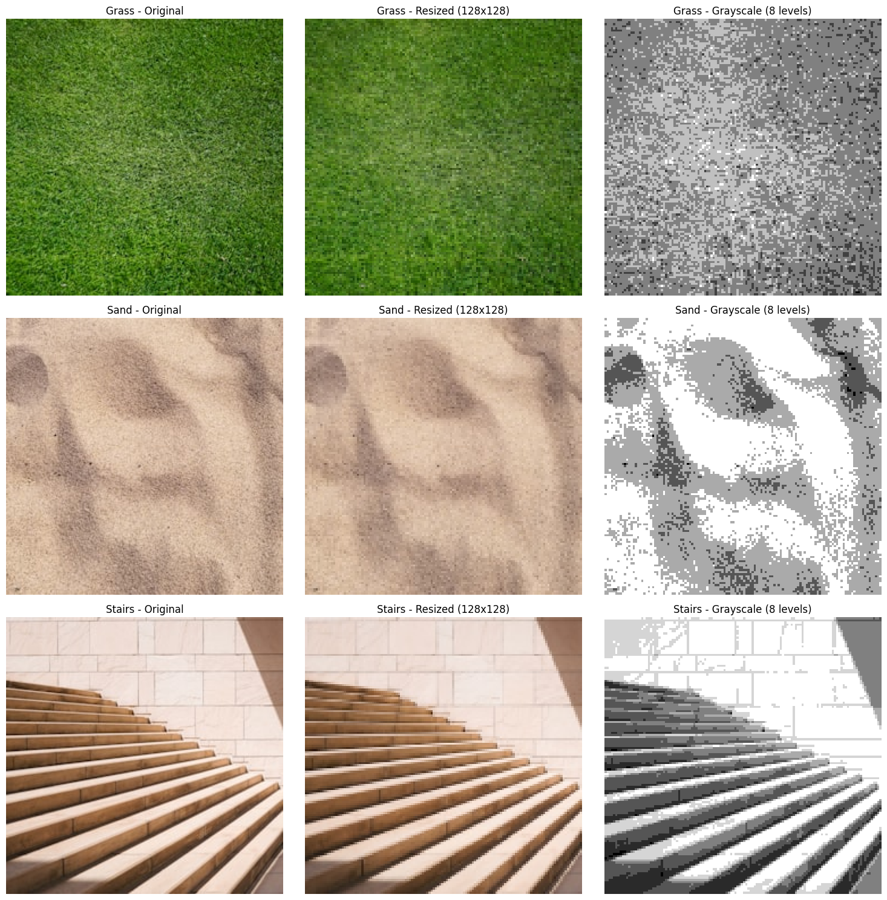
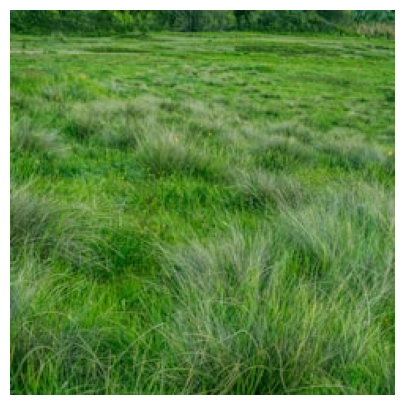
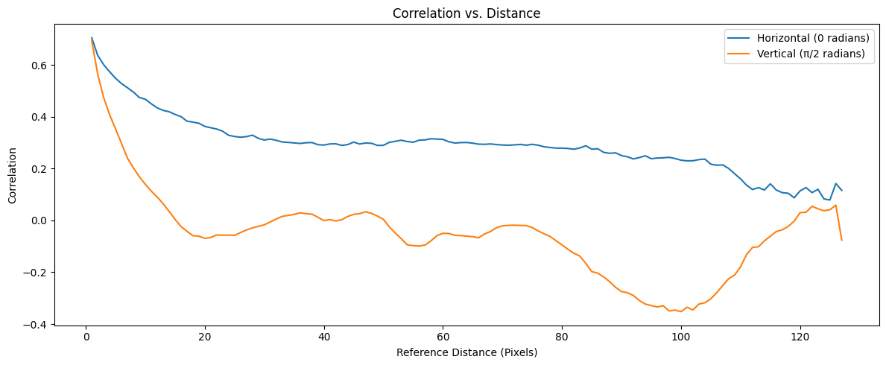
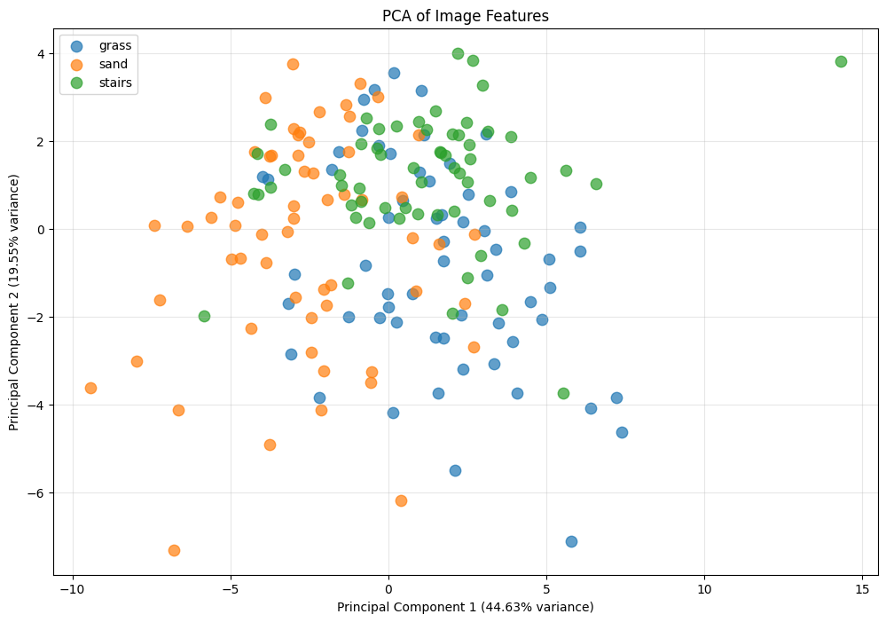
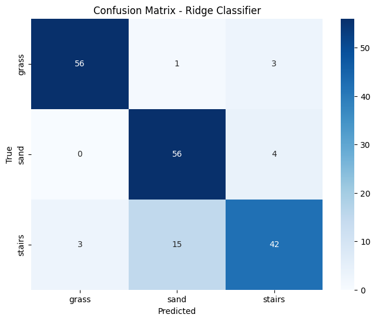
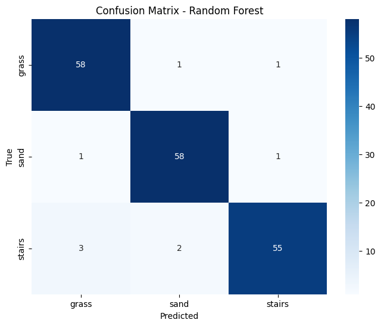
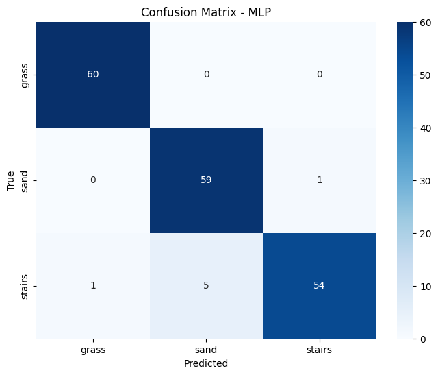

# Image Classification: Grass, Sand, and Stairs

## Overview
This project focuses on classifying three types of images: grass, sand, and stairs using machine learning techniques. The goal is to develop a model that can accurately identify and categorize these different textures based on their visual characteristics.


*(Create this image by displaying one sample from each category side by side)*

## Dataset
The dataset consists of images gathered from [Unsplash](https://unsplash.com/), a platform for high-quality stock photographs. The images are provided as URLs in text files, one for each category (grass, sand, and stairs). The images vary in resolution and dimensions, presenting a preprocessing challenge that is addressed in this project.

## Getting Started

### Prerequisites
- Python 3.7+
- Jupyter Notebook or Google Colab
- Required packages:
  ```
  numpy
  pandas
  matplotlib
  scikit-learn
  scikit-image
  requests
  PIL
  ```

### Installation
1. Clone this repository:
   ```
   git clone https://github.com/yourusername/image-classification.git
   cd image-classification
   ```

2. Install required packages:
   ```
   pip install -r requirements.txt
   ```

### Usage
1. Open the Jupyter notebook:
   ```
   jupyter notebook Image_Classification.ipynb
   ```
   
2. Run all cells to:
   - Download images from URLs
   - Preprocess images and extract features
   - Train and evaluate models
   - Visualize results

## Methodology

### Data Preparation
- Images are loaded from URLs and standardized to 128x128 pixels
- Conversion to grayscale with 8 quantization levels for texture analysis
- Dataset is split into training and testing sets with stratification


*(Create this image from the preprocessing visualization in your notebook)*

### Feature Extraction
Two types of features are extracted:

#### First-order Features (6 features)
- Mean for each RGB color channel
- Variance for each RGB color channel

#### Second-order Features (GLCM)
Gray Level Co-occurrence Matrix analyzes spatial relationships between pixels:
- Correlation: Measures linear dependencies between neighboring pixels
- Contrast: Measures local variations and sharp transitions
- Dissimilarity: Similar to contrast but with linear weighting
- Homogeneity: Measures closeness of distribution to diagonal
- ASM (Angular Second Moment): Measures uniformity of textures



*(Create this image from the correlation vs. distance plots in your notebook)*

### Exploratory Data Analysis
Several visualization techniques were used to understand the data:

- Correlation Matrix: Identified features with linear dependencies
- Feature Histograms: Showed distribution of features across classes
- PCA: Reduced dimensions to visualize natural clusters


*(Create this image from the PCA visualization in your notebook)*

### Model Training and Evaluation
Three classification models were implemented and evaluated using cross-validation:

1. **Ridge Classifier**
   - Hyperparameter: alpha (regularization strength)
   
   
2. **Random Forest**
   - Hyperparameters: n_estimators, max_features, bootstrap
   

3. **Multi-Layer Perceptron (MLP)**
   - Hyperparameters: hidden layer sizes, activation function, solver, alpha
   


## Results

| Model | Accuracy | Key Hyperparameters |
|-------|----------|---------------------|
| MLP | ~88.89% | hidden_layer_sizes=(100,), activation='tanh', solver='adam' |
| Ridge Classifier | ~86.11% | alpha=0.1 |
| Random Forest | ~72.22% | n_estimators=200, max_features='sqrt' |
