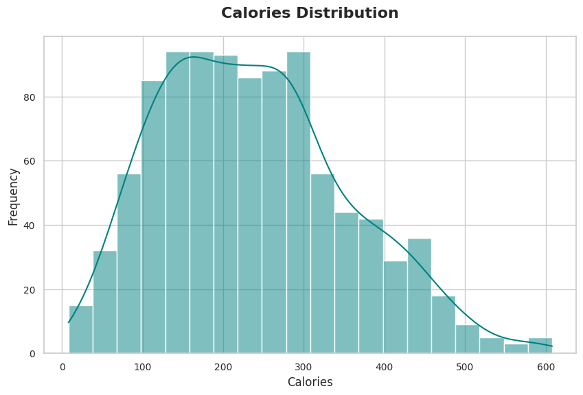
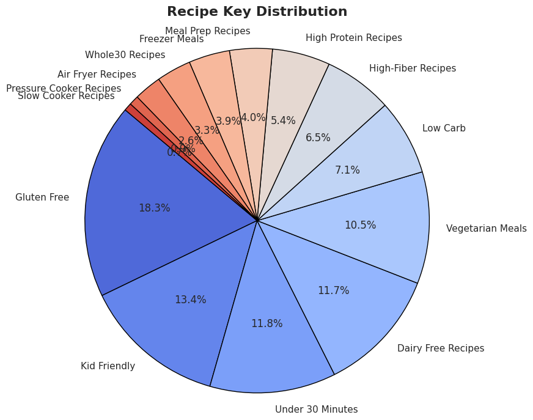
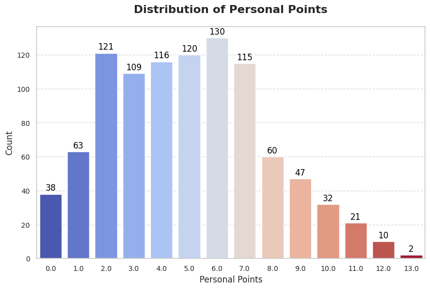

# Skinnytaste Recipe Scraper and Analyzer

A Jupyter Notebook-based application that scrapes recipe data from the Skinnytaste website, processes the information, and allows users to filter recipes based on nutritional properties.

## Overview

This project demonstrates web scraping techniques using Python libraries like Selenium and BeautifulSoup to collect recipe data from Skinnytaste, a popular healthy recipe blog. The collected data is then processed, analyzed, and visualized to provide users with insights into recipe calories, personal points, and categories.

## Features

- Asynchronous web scraping of recipe data from multiple pages
- Extraction of key recipe information:
  - Recipe name and image
  - Calorie content
  - Personal points
  - Summary descriptions
  - Recipe categories
- Data cleaning and processing
- Exploratory data analysis with visualizations:
  - Calorie distribution
  - Recipe category distribution
  - Personal points distribution
- Interactive recipe filtering based on calories and points

## Requirements

- Python 3.6+
- Chrome/Chromium browser
- The following Python libraries:
  - selenium
  - beautifulsoup4
  - pandas
  - matplotlib
  - seaborn
  - asyncio
  - aiohttp
  - nest_asyncio

## Installation

The notebook includes the necessary installation commands for a Google Colab environment. Run the installation cell to set up the required dependencies:

```python
# install chromium, its driver, and selenium
!apt update
!apt install libu2f-udev libvulkan1
# Additional installation commands included in notebook
```

## Project Structure

The notebook is organized into the following sections:

1. **Installation**: Setup of Chrome, Selenium, and other dependencies
2. **Driver Verification**: Checking that Chrome and ChromeDriver are correctly installed
3. **Imports**: Loading necessary Python libraries
4. **Data Scraping**: Asynchronous fetching of recipe data from Skinnytaste
5. **Data Cleaning & Processing**: Cleaning and preparing the collected data
6. **EDA and Visualization**: Analysis and visualization of recipe data
7. **User Interaction**: Interactive filtering of recipes based on nutritional criteria

## Data Analysis and Visualization

The notebook provides several visualizations to help understand the dataset:

### Calories Distribution

The histogram below shows the distribution of calories across all recipes:




### Recipe Categories Distribution

This pie chart displays the distribution of recipes across different categories:




### Personal Points Distribution

The bar chart shows the frequency of recipes with different personal points values:




## Usage

1. Run the notebook cells in sequence
2. The scraping process will collect recipe data from approximately 50 pages
3. After data collection, the application will prompt you to enter:
   - Minimum and maximum calorie values
   - Minimum and maximum personal points values
4. The application will display recipes matching your criteria, showing:
   - Recipe name
   - Calorie content
   - Personal points
   - Recipe summary
   - Recipe image

## Data Collection

The scraper extracts the following information for each recipe:
- Recipe name
- Image URL
- Calorie content
- Personal points value
- Recipe summary
- Recipe categories

## Adding Images to the README

To add the actual visualizations from the notebook:

1. Run all cells in the notebook to generate the visualizations
2. Use the following methods to save the images:
   - In Colab: Right-click on the visualization and select "Save image as..."
   - Alternatively, add the following code after each visualization to save it programmatically:
   ```python
   plt.savefig('visualization_name.png')
   ```
3. Create an "images" directory in your repository
4. Upload the saved images to this directory
5. Update the image paths in this README to point to your actual images

## Legal Disclaimer

This project is for educational purposes only. Web scraping may be against the terms of service of some websites. Before scraping any website, ensure you have permission and are complying with the website's robots.txt file and terms of service. The creator of this notebook is not responsible for any misuse of this code.

## Future Improvements

- Add more filtering options (by recipe category, cooking time, etc.)
- Implement recipe recommendation system
- Create a simple web interface for the application
- Add option to export filtered recipes to CSV or other formats