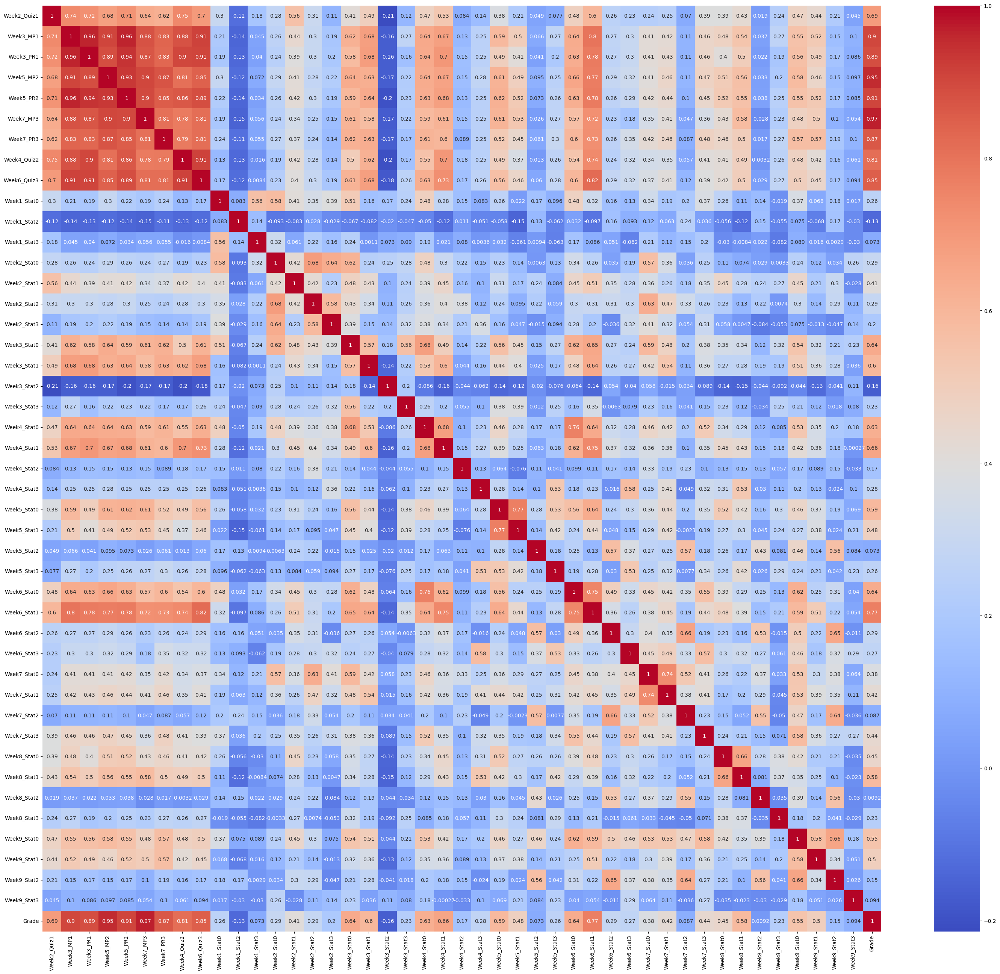
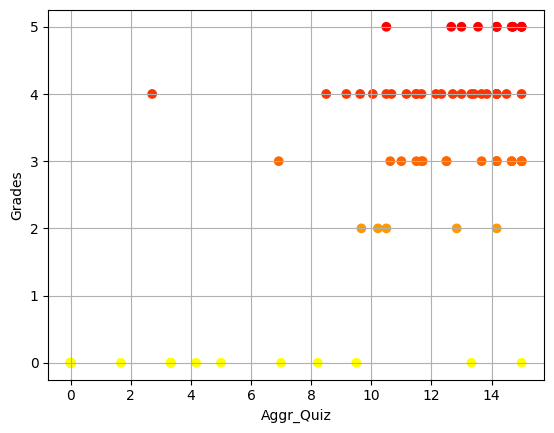
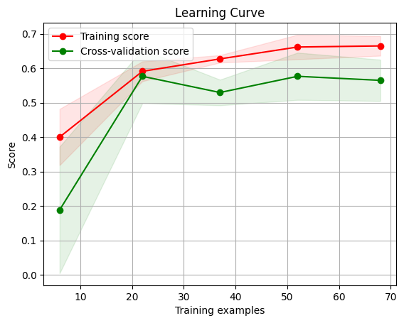
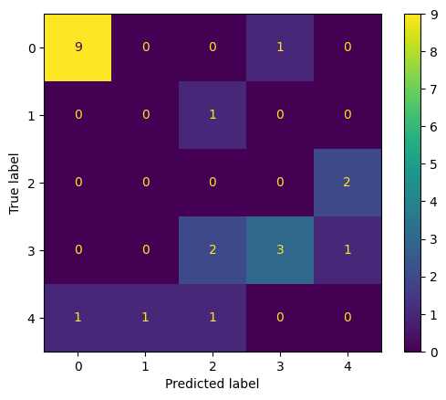
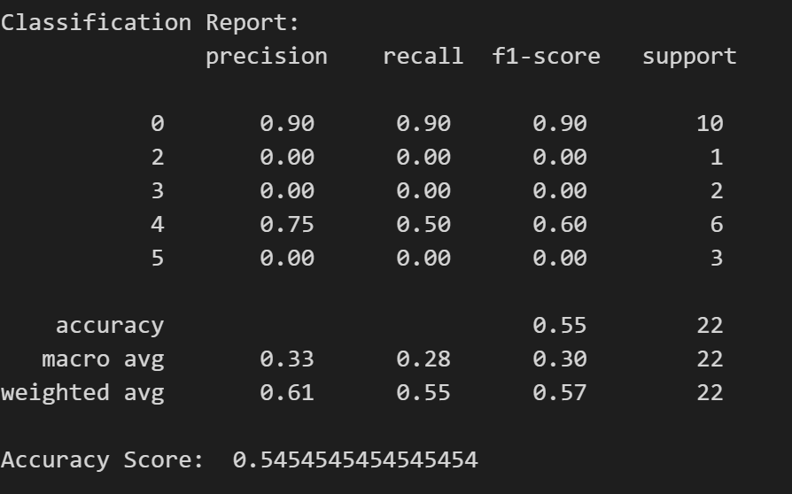
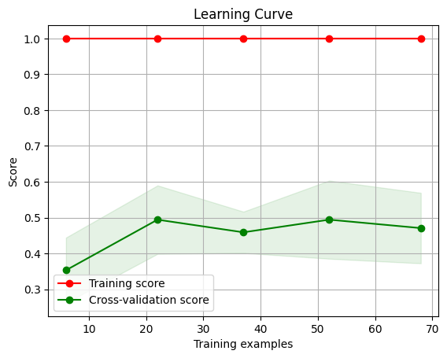
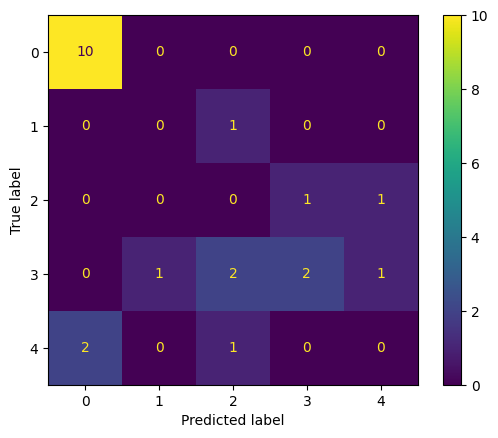
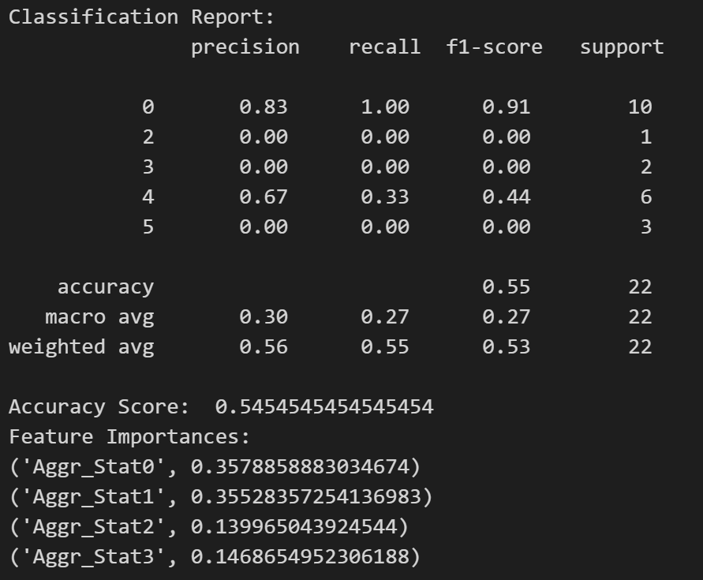

# Student Performance Analysis

## Overview
This project analyzes student performance data to identify patterns and factors that influence academic outcomes. The analysis is conducted using Python in a Jupyter notebook environment and employs various data analysis and machine learning techniques.

## Dataset
The dataset contains student performance metrics including:
- Demographic information (gender, age, etc.)
- Family background
- Study habits
- Previous academic performance
- Attendance
- Test scores and final grades

## Project Objectives
- Explore the relationship between various factors and student performance
- Identify key predictors of academic success
- Build predictive models to forecast student performance
- Provide insights that could help improve educational outcomes

## Requirements
- Python 3.6+
- Jupyter Notebook or Google Colab
- Required libraries:
  - pandas
  - numpy
  - matplotlib
  - seaborn
  - scikit-learn
  - statsmodels

## Getting Started

### Using Google Colab
1. Open Google Colab (https://colab.research.google.com)
2. Upload the notebook or open it directly from your Google Drive
3. Run the cells sequentially (Runtime > Run all or Ctrl+F9)

### Local Setup
1. Clone this repository
2. Install required packages:
   ```
   pip install -r requirements.txt
   ```
3. Launch Jupyter Notebook:
   ```
   jupyter notebook
   ```
4. Open the notebook file `student_performance.ipynb`

## Notebook Contents
The Jupyter notebook contains the following sections:

1. **Data Loading and Exploration**
   - Loading the dataset
   - Initial data inspection
   - Summary statistics

2. **Data Preprocessing**
   - Handling missing values
   - Feature engineering
   - Data normalization/standardization

3. **Exploratory Data Analysis**
   - Visualizations of key relationships
   - Correlation analysis
   - Distribution of grades and performance metrics

4. **Statistical Analysis**
   - Hypothesis testing
   - ANOVA
   - Regression analysis

5. **Machine Learning Models**
   - Feature selection
   - Model training and evaluation
   - Performance comparison of different algorithms

6. **Conclusions and Recommendations**
   - Summary of findings
   - Recommendations for improving student performance
   - Future work suggestions

## Sample Visualizations

Here are some sample visualizations generated from the analysis:

### Correlation Heatmap


*Figure 1: Correlation matrix showing relationships between different factors and student performance.*

### Feature Mapping 



### Model Performance Comparison
#### For KNN




#### For Random Forest





## Tips for Using the Notebook
- Make sure to run the cells in sequential order to avoid dependency issues
- Modify parameters in the designated cells to experiment with different approaches
- Use the markdown sections as a guide to understand the purpose of each code block
- For large datasets, consider using sample data for initial exploration

## Contributing
Feel free to fork this project and submit pull requests with improvements or additional analyses.

## Acknowledgments
- Dataset source: [provide source if applicable]
- Inspiration: Educational data mining research
